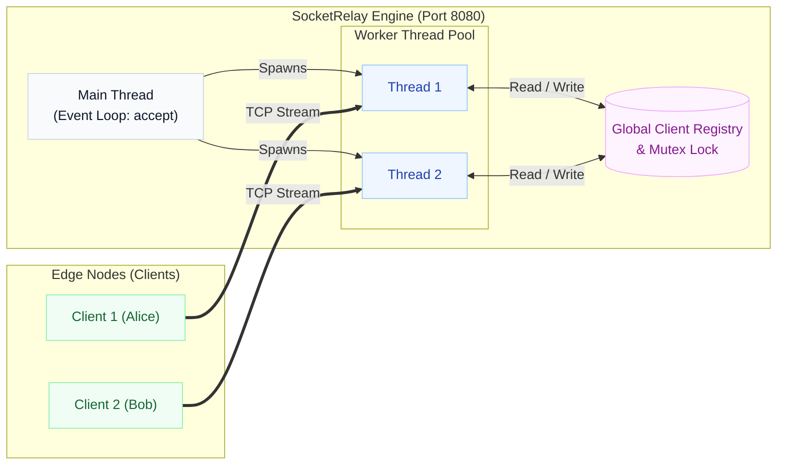
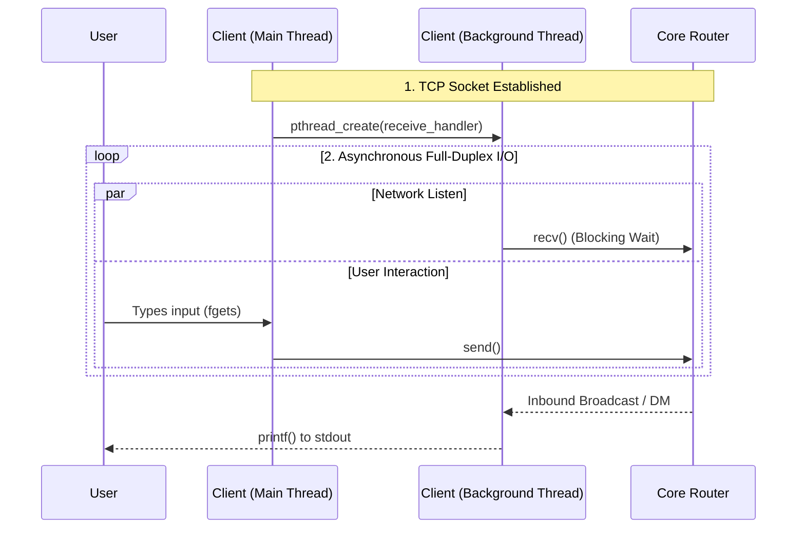

<div align="center">
  <h1>⚡ SocketRelay</h1>
  <p><b>High-Performance, Multithreaded TCP Messaging Router Built from First Principles</b></p>
  
  [](#)
  [](#)
  [](#)
  [](#)
</div>

---

> **The Challenge:** Modern distributed systems often rely on high-level frameworks (e.g., Node.js, gRPC) that obscure the underlying complexity of network I/O, state management, and thread contention, making it difficult to isolate low-level bottlenecks.
> 
> **The Solution:** A custom-built, multi-client concurrent terminal messaging platform that bypasses abstractions. Utilizing low-level Berkeley sockets and POSIX multithreading, SocketRelay achieves direct, full-duplex communication over TCP, demonstrating a rigorous, bottom-up approach to systems engineering.

---

## ⚙️ Core Capabilities

- **Concurrent Execution:** Thread-per-client architecture handles simultaneous connections without blocking.
- **Stateful Routing:** Dynamic edge node registry enables global broadcasts and targeted private messaging.
- **Thread-Safe State:** POSIX mutex locks (`pthread_mutex_t`) protect shared memory from data races.
- **Asynchronous I/O:** Dual-threaded clients asynchronously send and receive TCP streams concurrently.

---

## 🏗️ System Architecture & Orchestration

The platform implements a centralized routing architecture that maintains state and securely directs traffic between edge nodes using a thread-per-client concurrency model.



### Full-Duplex Client Operation

To prevent the application from blocking on `stdin` (waiting for user input), the client node separates reading and writing into independent, concurrent execution paths.



---

## 💡 Engineering & Architectural Decisions

In high-performance systems, the "why" matters as much as the "how". Here is the rationale behind the system's design, along with an honest audit of its tradeoffs and hardening paths:

| Component / Challenge | Technical Implementation | Rationale & Tradeoff Analysis |
| :--- | :--- | :--- |
| **Concurrency Model** | **Thread-per-Client (`pthread`)** | Ensures strictly isolated execution contexts per connection. *Tradeoff:* High memory overhead for context switching at scale. An enterprise iteration would migrate to an event-driven, non-blocking I/O model (e.g., `epoll` or `kqueue`). |
| **State Integrity** | **Coarse-Grained Mutex Locking** | Protects the shared client registry from race conditions during simultaneous broadcasts. *Tradeoff:* Creates a lock contention bottleneck under heavy load; optimizing this requires fine-grained locking or lock-free data structures. |
| **Memory Safety** | **Fixed-Size Buffers & Arrays** | Hardcoded `MAX_CLIENTS` allows for predictable memory footprints. *Tradeoff:* Susceptible to bounds overflow if capacity logic fails. Hardening requires dynamic allocation and strict memory lifecycle management. |
| **Stream Framing** | **Raw TCP `recv()`** | Interacts directly with the kernel networking stack for zero-abstraction transmission. *Tradeoff:* TCP is a continuous stream, meaning fragmented payloads can occur. Production readiness requires application-level framing (e.g., length-prefixing). |

---

## 🚀 Quickstart & Reproduction

The system compiles natively on POSIX-compliant environments (Linux / macOS) without external dependencies.

**1. Compile the Core Modules**
```bash
gcc Server.c -o server -lpthread
gcc client.c -o client -lpthread
```

**2. Initialize the Core Router**
```bash
./server
```
*(The engine binds to local port `8080` and begins listening).*

**3. Connect Edge Nodes**
*(Open a new terminal window for each client)*
```bash
./client
```
*(Enter a unique username upon connection to register with the core router).*

---
> 🔐 Licensed under **Apache License 2.0**  
> 📌 Developed by **Sri Vighna Teja** | 2025

<div align="center">
  <i>Engineered to demonstrate first-principles distributed systems architecture, concurrency management, and atomic network programming.</i>
</div>
